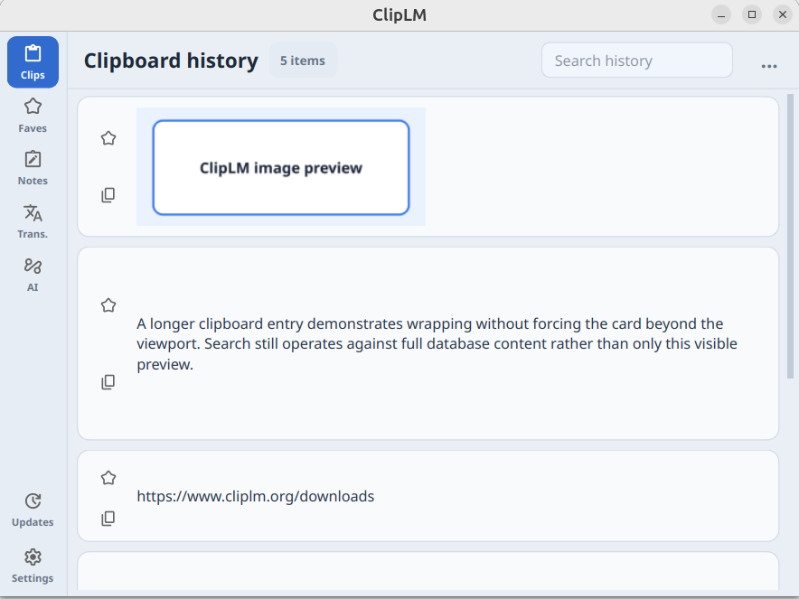

# ClipLM

**Your intelligent clipboard workspace.**

ClipLM saves your clipboard history and lets you search, reuse, translate, or run
AI prompts on copied text and images. Press `Ctrl+C` twice on the same text to
make ClipLM pop up near the cursor with the **AI** tab open. Copied images are
prepared in the AI tab automatically for quick actions.



## Run with uv

ClipLM requires Python 3.10 or newer and
[`uv`](https://docs.astral.sh/uv/getting-started/installation/).

```bash
uv sync
uv run python src/main.py
```

## Core features

- Clipboard history for text, rich text, URLs, and images
- Search across clips, favorites, and notes
- One-click copy and paste from saved items
- Favorites for frequently used content
- Reusable notes with titles
- Translation with Google Translate or an LLM
- Reusable AI prompts for copied text and images
- Double-copy (`Ctrl+C` twice) to open copied content in the AI tab
- Multiple OpenAI-compatible LLM profiles

## Using ClipLM

Keep ClipLM running while you work. Copied items are added to **Clips**
automatically.

- Click a clip, favorite, or note to paste it.
- Use the copy button to copy without pasting.
- Hold `Shift` while copying or pasting formatted text to use plain text.
- Star a clip to move it to **Faves**.
- Use **New note** to save reusable text with a title.
- Press `/` in Clips, Faves, or Notes to start searching.

### AI prompts

Open **Settings**, add an OpenAI-compatible LLM profile, and select it as the
default. In the **AI** tab, click a saved prompt to run it on the current clipboard
content.

Press `Ctrl+C` twice on the same text to make ClipLM pop up near the cursor with
the AI tab open and the text ready as input. An image only needs to be copied once;
ClipLM automatically makes it available as AI input. Use `+` to add prompts and
the `...` menu to edit or delete them. AI responses can be copied or pasted from
the output area.

### Translation

Open **Translate** to load the current clipboard text. Select the source and
destination languages, choose Google Translate or LLM in Settings, and click
**Translate**. The reverse button swaps the selected languages when the source is
not set to Auto.

## Keyboard shortcuts

| Key | Action |
| --- | --- |
| `C` | Open the Clips tab |
| `F` | Open the Faves tab |
| `N` | Open the Notes tab |
| `T` | Open the Translate tab |
| `T` again | Translate the current text |
| `A` | Open the AI tab |
| `S` | Open the Settings tab |
| `/` | Search Clips, Faves, or Notes |
| `Esc` | Leave the search field |

## Linux

Automatic paste on Wayland requires `ydotool` and a running `ydotoold`. If they
are unavailable, ClipLM still supports copying items for manual paste.
